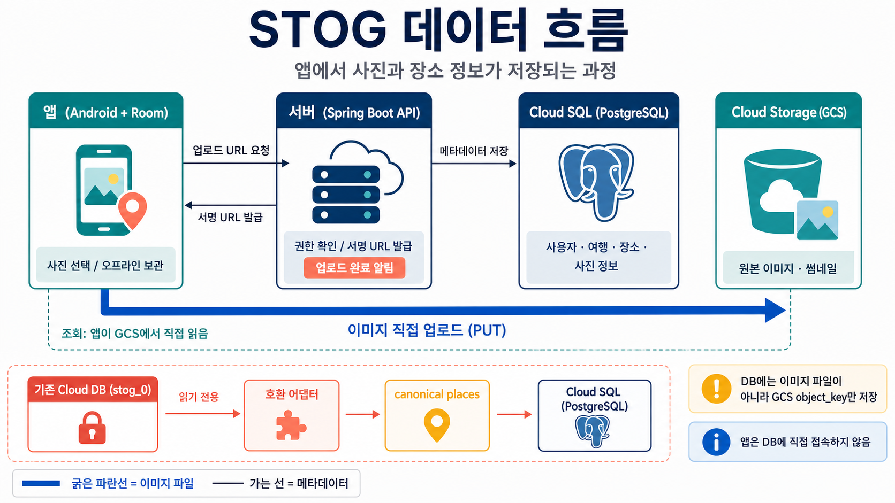

<div align="center">
  

  <h1>STOG</h1>

  <p><strong>여행의 순간을 공간에 담고, 다음 여정을 설계하는 기록 서비스</strong></p>

  <p>
    <a href="https://github.com/H0GUN3/STOG">
      
    </a>
    <a href="https://kotlinlang.org/">
      
    </a>
    <a href="https://spring.io/projects/spring-boot">
      
    </a>
    <a href="https://www.postgresql.org/">
      
    </a>
  </p>
</div>

<p align="center">
  
  
</p>

## STOG는 무엇인가요?

STOG는 **STEP + LOG**에서 출발한 Android 여행 기록·계획 서비스입니다.
여행 중 지나온 공간과 사진을 하나의 `cell`에 담고, 여행 전에는 장소를
일정으로 정리하며, 여행 후에는 기억을 다시 꺼내 보고 나눌 수 있습니다.

> 공공데이터가 놓친 지역의 맥락을 사용자의 이동과 사진으로 보완하고,
> 그 결과를 다시 지역을 이해하는 데이터로 돌려줍니다.

## 핵심 경험

| 여행 전 | 여행 중 | 여행 후 |
| --- | --- | --- |
| 검색과 공유 담기로 장소 수집 | 이동에 따라 cell 기록 | 보관함에서 여행과 사진 회고 |
| 일정 바구니와 카드 대시보드 | 방문·통과 판정 | 사진 게시물과 공개 피드 |
| 일정 순서 조정과 동선 검증 | STOG Set Log Camera | 좋아요·댓글·저장·일정 복사 |

### STOG만의 기록 방식

- **검색되지 않는 지역을 발견**: H3 기반 `cell`에 장소와 사용자 활동을 연결합니다.
- **외부에서 본 장소도 수집**: 공유 담기로 링크를 받아 여행 일정의 후보로 보관합니다.
- **기억을 다시 여행으로 연결**: 사진, 동선, 방문 기록을 여행 단위로 남깁니다.
- **계획과 기록을 한 흐름으로**: 카드 대시보드에서 장소를 정리하고 여행 후 결과를 회고합니다.

## 기술 구조

```text
Android App (Kotlin + Jetpack Compose)
        |
        | REST / JSON
        v
Spring Boot API (Java 17)
        |
        +--> PostgreSQL 18.4 + Flyway
        +--> Google Places / Routes
        +--> Google Cloud Storage signed URL
        +--> H3 cell calculation
```

### 기술 스택

| 영역 | 선택 |
| --- | --- |
| Client | Android, Kotlin, Jetpack Compose, Room, WorkManager |
| Map & space | Google Maps SDK for Android, H3 |
| API server | Java 17, Spring Boot 4.1, Spring Data JPA |
| Persistence | PostgreSQL 18.4, Flyway, Hibernate `ddl-auto=validate` |
| Media | Google Cloud Storage signed URL, 앱에서 직접 업로드 |
| Build | Gradle Wrapper 9.5, Kotlin DSL |

Android는 장소 검색, 동선 계산, 데이터베이스, 미디어 정책을 직접 처리하지
않습니다. 앱은 Spring Boot API를 사용하며, 사진 바이트는 서명된 URL을 통해
Google Cloud Storage로 직접 전송합니다.

## 저장소 구성

```text
STOG/
├── app/                    # Android 앱
├── backend/                # 독립 실행 Spring Boot API
├── docs/                   # 제품·아키텍처·용어 canonical 문서
├── infra/                  # Cloudflare 및 GCP 배포 자료
├── gradle/                 # Version catalog와 Gradle Wrapper
├── DEVELOPMENT.md          # 개발환경, 실행, 검증 절차
└── AGENTS.md               # 저장소 작업 규칙
```

`backend`는 root Gradle 프로젝트의 하위 모듈이 아니라 독립 Gradle 빌드입니다.
따라서 backend 명령은 저장소 루트에서 `-p backend`를 사용합니다.

## 시작하기

### 요구 환경

- Android Studio Quail 3 (2026.1.3) / JetBrains Runtime 25.0.2
- Android SDK Platform 37
- Java 17 (backend toolchain)
- PostgreSQL 18.4
- Android Emulator Pixel 8 / API 36 또는 연결된 Android 기기

세부 버전과 데이터베이스 권한 경계는
[`DEVELOPMENT.md`](DEVELOPMENT.md)를 먼저 확인하세요.

### 1. 저장소 받기

```powershell
git clone https://github.com/H0GUN3/STOG.git
cd STOG
```

### 2. Backend 설정과 실행

실제 비밀번호와 API key는 저장소에 넣지 않습니다.
추적 가능한 변수명 템플릿만 [`backend/.env.example`](backend/.env.example)에
있으며, 값은 로컬 `backend/.env` 또는 운영 환경의 Secret Manager에 주입합니다.

```powershell
Copy-Item backend/.env.example backend/.env

# disposable test database가 준비된 경우
cmd.exe /d /c "gradlew.bat -p backend test"

# local PostgreSQL 설정 후 실행
cmd.exe /d /c "gradlew.bat -p backend bootRun"
```

Backend 기본 주소는 `http://localhost:8080`입니다.
테스트는 개발 데이터베이스가 아닌 disposable `stog_backend_test`만 사용합니다.

### 3. Android 설정과 빌드

Android 빌드에는 로컬의 무시된 `secrets.properties`가 필요합니다.
Kakao Native App Key, 제한된 Maps API key, 연결할 STOG API 주소를
개발환경에 맞게 설정하세요. 실제 값은 커밋하지 않습니다.

```powershell
# 실기기: 현재 살아 있는 public HTTPS backend 또는 Quick Tunnel 사용
$env:STOG_API_BASE_URL = "https://<reachable-backend-or-tunnel>"
.\gradlew.bat :app:assembleDebug `
  -PstogApiTarget=phone `
  -PstogApiBaseUrl=$env:STOG_API_BASE_URL

# Android host unit test
.\gradlew.bat :app:testDebugUnitTest `
  -PstogApiTarget=phone `
  -PstogApiBaseUrl=$env:STOG_API_BASE_URL
```

실기기 빌드에는 `localhost`, `127.0.0.1`, `10.0.2.2`, LAN 주소를
사용하지 않습니다. 에뮬레이터 주소 정책과 endpoint 검증 규칙은
[`DEVELOPMENT.md`](DEVELOPMENT.md) 및 `app/build.gradle.kts`를 기준으로 합니다.

## 품질과 안전 경계

- 제품·API·DB 계약의 원본은 [`docs/*.yaml`](docs/)입니다.
- 용어를 추가하거나 바꾸기 전 [`docs/glossary.yaml`](docs/glossary.yaml)을 확인합니다.
- DB schema 변경은 Flyway forward migration으로만 관리합니다.
- 인증, 권한, 계정 격리, test database 보호 규칙을 약화하지 않습니다.
- `secrets.properties`, `.env`, `local.properties`, build 산출물은 커밋하지 않습니다.
- `cells` 테이블, PostGIS, WebSocket 동기화, 무분별한 provider 직접 호출은 사용하지 않습니다.

## 문서 지도

| 문서 | 목적 |
| --- | --- |
| [`docs/glossary.yaml`](docs/glossary.yaml) | 제품 용어와 금지 표현 |
| [`docs/product.yaml`](docs/product.yaml) | 문제 정의, 기능 우선순위, 제품 결정 |
| [`docs/architecture.yaml`](docs/architecture.yaml) | API, DB, provider, 알고리즘 계약 |
| [`docs/conventions.yaml`](docs/conventions.yaml) | 개발·Git·검증 규칙 |
| [`docs/pitfalls.yaml`](docs/pitfalls.yaml) | 역할별 주의사항 |
| [`docs/OVERVIEW.md`](docs/OVERVIEW.md) | 제품 배경과 데모 흐름 |
| [`DEVELOPMENT.md`](DEVELOPMENT.md) | 환경 구성, 실행, runtime 검증 |

문서 간 내용이 충돌하면 canonical YAML을 우선합니다.

## 기여하기

1. 관련 canonical 문서와 기존 구현을 먼저 확인합니다.
2. 기능 단위로 영향 범위와 재사용 가능 코드를 정리합니다.
3. 변경에 필요한 최소 범위만 수정하고 직접 관련 검증을 실행합니다.
4. 기능 ID, 스펙 변경 여부, 영향 역할, 검증 결과를 Pull Request에 기록합니다.

## 현재 범위

STOG의 제품 범위와 구현 상태는 문서와 코드가 함께 움직입니다.
완료된 기능, 진행 중인 기능, 보류된 결정은
[`docs/product.yaml`](docs/product.yaml)의 기능 목록과 결정 이력을 기준으로
확인할 수 있습니다.
