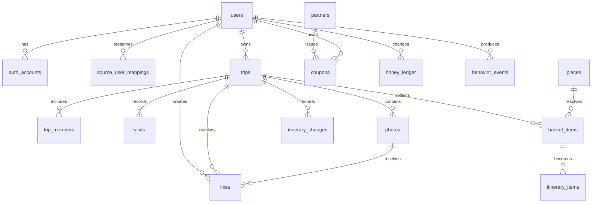

# STOG DB 아키텍처 초안

> 상태: draft  
> PostgreSQL 18.4 로컬 개발 DB와 Cloud SQL 기준의 설명 문서다. 실제 schema와 migration의
> 기준은 `docs/architecture.yaml`이며, 이 문서와 충돌하면 YAML을 먼저
> 갱신한다.

## 0. 개발 DB 연결 계약

로컬 개발 DB는 PostgreSQL 18.4이며 다음 값으로 만든다.

| 항목 | 값 |
|---|---|
| DB | `stog_canonical_dev` (isolated development database) |
| migration user | `stog_migrator` |
| application user | `stog_app` |
| host | `localhost` |
| port | `5432` |

Spring Boot만 DB에 접근한다. Android 클라이언트는 PostgreSQL에 직접
연결하지 않고 Spring Boot API만 호출한다.

연결 정보는 저장소 파일이나 코드에 기록하지 않고 다음 환경변수에서
읽는다.

```text
MIGRATOR_DB_URL=jdbc:postgresql://localhost:5432/stog_canonical_dev
MIGRATOR_DB_USERNAME=stog_migrator
MIGRATOR_DB_PASSWORD=<local password>
DB_URL=jdbc:postgresql://localhost:5432/stog_canonical_dev
DB_USERNAME=stog_app
DB_PASSWORD=<local password>
```

DB 비밀번호는 문서·소스·APK에 기록하지 않는다. C-drive persistence는 환경
최적화로 미루며, 기존 로컬 `stog`와 Cloud SQL `stog_0`는 canonical 개발 DB로
사용하지 않는다.

### 서버 DB 기술 계약

- ORM: Spring Data JPA / Hibernate
- JDBC driver: PostgreSQL JDBC Driver
- migration: Flyway
- schema management: Flyway 우선
- Hibernate `ddl-auto`: `validate`

## 1. 설계 원칙

- `cell`은 좌표에서 계산한다. `cells` 테이블을 만들지 않는다.
- DB의 `cell_id`는 H3 64비트 정수 `BIGINT`로 저장한다.
- API의 `cell_id`는 16진 문자열로 직렬화한다.
- 모든 공간 데이터는 원본 `lat`, `lng`와 `cell_id`를 함께 가진다.
- 사용자 인증, 권한, 중복 요청, 리워드 정합성은 애플리케이션 판단만
  믿지 않고 DB 제약과 transaction으로 보강한다.
- provider 검색 결과와 사용자가 확정한 `place`를 같은 상태로 취급하지
  않는다.
- 약관 확인 전 provider 결과를 공용 장소 자료로 승격하지 않는다.
- 사진 파일은 GCS 객체이고 DB에는 메타데이터와 객체 키만 저장한다.
- AI는 DB의 직접 writer가 아니다. 사용자가 확정한 action을 API가
  transaction으로 적용한다.

## 2. 도메인별 테이블

| 영역 | 테이블 | 책임 |
|---|---|---|
| 인증 | `users`, `auth_accounts`, `source_user_mappings` | provider와 무관한 사용자, 로그인 수단, 기존 Cloud source 사용자 연결 |
| 기록 | `trips`, `trip_members`, `visits`, `photos` | 여행, 참여, 셀 이동, 사진 |
| 계획 | `places`, `basket_items`, `itinerary_items`, `itinerary_changes` | 장소 후보, 일정 바구니, 날짜·순서, 변경 이력 |
| 공간 집계 | `cell_stats` | 방문·사진·좋아요 기반 셀 표시 |
| 소셜 | `likes` | 여행과 사진의 사용자별 반응 |
| 리워드 | `partners`, `coupons`, `honey_ledger` | 제휴처, 쿠폰, 꿀 증감 원장 |
| 지역 생성 | `street_candidates`, `street_name_votes` | 이름 없는 셀 군집과 사용자 명명 |
| 성향 | `behavior_events` | 최근 행동 기반 성향 갱신 입력 |
| 행사 | `events` | 동기화된 지역 행사 |

`events`는 TourAPI `searchFestival2`의 공개 동기화 결과만 보존한다.
`(provider, external_id)`를 unique key로 사용하고, `title`,
`venue_name`, `formatted_address`, 좌표, `starts_on`, `ends_on`,
`detail_uri`, `image_uri`, `source_updated_at`, `status`를 정규화한다.
기간이 끝났거나 upstream에서 철회된 행사는 삭제하지 않고 `retired`로
숨긴다. 사용자 행사 생성·수정 데이터는 이 테이블에 섞지 않는다.

## 3. 관계 개요



`likes.target_id`처럼 두 종류 대상을 하나의 컬럼으로 가리키는 관계는
일반 외래키로 완전히 보장되지 않는다. API에서 대상 종류별 존재 여부와
공개 범위를 확인하고, 집계 cache 갱신을 같은 transaction 경계에서
관리한다.

## 4. 핵심 관계와 권한

### 사용자와 인증

- `users`는 로그인 provider와 무관한 사용자 프로필이다.
- `auth_accounts`는 `(provider, provider_user_id)`를 unique로 둔다.
- local 계정은 정규화된 이메일과 BCrypt hash를 저장한다.
- social 계정은 provider가 검증한 식별자를 저장한다.
- provider secret과 원문 비밀번호는 저장하지 않는다.
- `source_user_mappings.source_user_uuid`는 기존 Cloud source의 UUID를 보존하고
  `users.id`를 참조한다.
- source mapping을 채우는 Cloud import는 별도 승인을 받은 뒤에만 수행한다.

### 여행과 참여자

- `trips.owner_id`가 그룹장 판정의 단일 기준이다.
- `trip_members`에는 그룹장 role을 중복 저장하지 않는다.
- active 참여자만 일정 바구니와 일정 변경을 수행할 수 있다.
- 그룹장만 초대 링크 발급과 참여자 삭제를 수행한다.
- 그룹장 이탈과 초대 링크 정책은 A-04, A-05 결정 전까지 구현하지
  않는다.

### 장소와 일정

- `place`는 검색되는 상호나 시설이고, 사진 촬영 좌표인 `spot`과
  다르다.
- `basket_items`는 날짜와 순서가 없는 후보 목록이다.
- `itinerary_items`는 `basket_items`에 날짜·순서를 부여한다.
- `unresolved` 항목은 바구니에 남지만 동선 계산에는 들어가지 않는다.
- 사용자가 확정하지 않은 검색 후보는 일정과 `trail`에 반영하지 않는다.

### 사진

- `photos`에는 `original_key`, `thumb_key`를 저장한다.
- 업로드 URL 한 번의 응답으로 original과 thumbnail용 signed PUT URL을
  각각 발급한다.
- GCS 업로드가 성공한 뒤에만 사진 metadata row를 만든다.
- `visibility`는 private/group/public 조회에 사용한다.
- `like_count`는 집계 cache이고 실제 권한 기준이 아니다.
- private/group 사진은 공개 URL을 저장하지 않고 authorized read를 통해
  짧은 만료의 signed URL을 발급한다.
- 현재 생성·변경·조회 권한은 trip owner로 제한한다. `group` 권한은
  `trip_members` 권한 계약이 확정된 뒤 확장한다.
- 사진 metadata row와 signed GET URL은 local canonical DB와 명시적
  `gcs-write` profile 경계 안에서만 처리한다. Cloud source import는 별도
  승인 없이는 수행하지 않는다.

## 5. 공유 담기 저장안

사용자 요구사항은 하나의 Instagram 게시물에서 여러 장소를 발견하고
각 장소를 개별적으로 확인하는 것이다. 기존 `basket_items`만으로 원본,
여러 후보, 사용자 결정을 모두 보존하기 어렵다.

### 5.1 권장 draft 구조

```text
share_import
  ├── share_mentions
  │     └── place_candidates
  └── share_decisions

basket_items
  ├── 원본 link_block  (확인 전)
  └── 확정된 place 항목 (장소별 0..N개)
```

#### `share_imports`

공유 한 번의 원본과 전체 처리 상태를 보관한다.

- `id`, `trip_id`, `added_by`
- `source`: `kakao`, `naver`, `instagram`, `unknown`
- `original_url`, `raw_text`, `raw_html`
- 내부 저장 객체 key 또는 첨부 metadata
- `status`: `saved`, `processing`, `needs_review`, `completed`, `failed`
- `last_error_code`, `created_at`, `updated_at`

#### `share_mentions`

원본에서 발견한 장소 언급을 보관한다. 한 공유 원본에 여러 개가
생길 수 있다.

- `id`, `share_import_id`
- 원문 일부와 순서
- 추출된 제목·주소
- 추출 방법과 confidence
- `status`: `candidate`, `accepted`, `rejected`, `deferred`

#### `place_candidates`

특정 언급에 대해 provider 검색에서 얻은 후보를 보관하는 임시 구조다.

- `id`, `mention_id`
- `provider`, `external_id`
- 이름·주소·좌표·분류·상세 URL
- 검색 순위, 조회 시각, 만료 상태

provider 결과의 보존과 재사용 권한이 확인되지 않은 동안에는 서버
canonical 자료로 장기 보존하지 않고, Android Room 또는 짧은 TTL의
처리 결과로 제한한다.

provider 결과의 보관과 재사용 권한이 확인되지 않은 동안에는 서버
canonical 자료로 장기 보존하지 않고, Android Room 또는 짧은 TTL의
처리 결과로 제한한다.

#### `share_decisions`

사용자가 후보를 확인하거나 거절한 이력을 append-only로 보관한다.

- `id`, `mention_id`, `user_id`
- `action`: `confirm`, `reject`, `edit`, `defer`
- 선택한 후보 또는 사용자가 입력한 장소 정보
- 결정 시각과 처리 버전

사용자 확인 후 장소별 `basket_item`을 만든다. Instagram 원본 하나에서
여러 장소를 확인하면 여러 `basket_item`이 같은 `share_import_id`를
가질 수 있다.

### 5.2 현재 미결정

위 구조는 데이터 의미를 보존하는 권장안이지만, canonical schema
변경은 다음 중 사용자 확인 뒤에 진행한다.

1. `share_imports`·`share_mentions`·`share_decisions`를 별도 테이블로
   추가한다.
2. `basket_items`에 JSON과 parent 관계를 추가해 최소 테이블로 처리한다.

여러 장소, 확인 이력, 재처리 상태를 모두 보존해야 하므로 1번이 더
명확하지만 테이블 수가 늘어난다.

화면에서는 source별 section을 제공하지만, 이 section은 같은
`basket`의 필터·그룹 표현이다. source별 테이블이나 source별 `trip`을
만드는 결정이 아니다.

## 6. 무결성 규칙

| 대상 | DB 또는 transaction 규칙 |
|---|---|
| 인증 계정 | `(provider, provider_user_id)` unique |
| 그룹 참여 | `(trip_id, user_id)` primary key |
| 여행 좋아요 | `(user_id, target_type, target_id)` primary key |
| 쿠폰 | `(partner_id, user_id, issued_date)` unique |
| 쿠폰 수량 | partner row lock 후 일일 quota 검사 |
| 꿀 | `honey_ledger` append-only, 잔액은 cache |
| 일정 변경 | `itinerary_changes` append-only |
| 사진 | GCS 업로드 성공 후 metadata insert |
| 위치 | 앱 local 저장 후 서버 전송, idempotency key 사용 |
| AI 제안 | 제안 저장과 실제 일정 변경을 분리 |

쿠폰 사용 확정, 꿀 차감, 정산 표시는 하나의 transaction에서 처리한다.
이미 확정된 transaction의 보정만 별도 compensating transaction으로
처리한다.

## 7. 조회와 인덱스

- `cell_id`: 셀 기반 조회의 모든 공간 테이블에 B-tree index
- `places(lat, lng)`: 좌표 후보 정렬 보조
- `visits(trip_id, entered_at)`: 여행 동선 순서
- `photos(cell_id, like_count DESC)`: 셀 대표 사진
- `itinerary_items(trip_id, day_number, order_index)`: 카드 대시보드
- `itinerary_changes(trip_id, created_at DESC)`: 변경 이력
- `behavior_events(user_id, created_at DESC)`: 최근 행동 window

viewport를 H3 전체 목록으로 만든 뒤 큰 `IN` 절에 넣지 않는다. 좌표
범위로 후보를 조회하고 결과를 `cell_id`로 묶는다. 정확한 거리 조건이
필요하면 H3 이웃 후보를 코드에서 거리 계산으로 다시 확인한다.

## 8. 삭제와 보존

- 사용자가 삭제한 공유 원본은 원본 파일, 파생 후보, 대기 작업까지
  삭제 대상으로 삼는다.
- provider 결과의 보존 기간은 provider별 약관 확인 전까지 확정하지
  않는다.
- 사용자 사진은 `visibility`와 여행 탈퇴 정책에 따라 별도 처리한다.
- 만료된 행사와 철회된 공공데이터는 숨김 또는 retire 상태로 처리한다.
- DB backup과 GCS object lifecycle은 개인정보 보존 정책과 함께 정한다.

## 9. 구현 전 DB 결정

- `share_imports` 계열 테이블을 추가할지
- `events`에 provider `external_id`, `modifiedtime`, `showflag`를
  추가할지
- `places.source`에 Instagram 또는 confirmed share를 표현할지
- provider 후보의 TTL과 재사용 범위
- private/group 사진의 authorized read path
- idempotency record와 settlement marker의 구체 schema

## 10. 현재 관계·제약조건 작업 기준

다음 기준을 핵심 schema 작업의 출발점으로 사용한다.

### 필수 unique·primary key

```text
auth_accounts(provider, provider_user_id)
trip_members(trip_id, user_id)
likes(user_id, target_type, target_id)
coupons(partner_id, user_id, issued_date)
street_name_votes(street_id, user_id)
```

### 필수 transaction

- local 회원가입: `users`와 `auth_accounts`를 함께 생성
- 사진 등록: GCS 업로드 성공 후 `photos` metadata 생성
- 일정 변경: `itinerary_items` 변경과 `itinerary_changes` 기록을 같은
  요청에서 처리
- 쿠폰 발급: partner quota 검사, coupon row, 꿀 차감을 하나의
  transaction으로 처리
- 쿠폰 사용: QR 검증, 상태 변경, 꿀 원장과 정산 표식을 같은
  transaction으로 처리
- 공유 장소 확정: 사용자 결정 기록과 장소·바구니 연결을 함께 처리

### 권한 기준

- 사용자: 본인의 `users`, private `trips`, private `photos`,
  `behavior_events`만 조회
- active 참여자: 해당 `group_trip`의 `basket`과 `itinerary` 조회·수정
- owner: 초대 링크와 참여자 관리
- public 조회자: 공개된 `trip`, `photo`와 허용된 사용자 생성 자료만 조회
- AI: 읽기 전용 입력만 받고, 일정 변경은 일반 API action으로 요청

## 11. 사진 접근과 signed URL

사진 객체는 GCS 버킷에 저장하고 기본적으로 공개하지 않는다. Android는
사진 bytes를 API 서버로 보내지 않고 signed URL을 사용한다.

### 업로드

1. 인증된 사용자가 파일 종류와 크기 metadata로
   `POST /photos/upload-url`을 호출한다.
2. 서버는 소유자·여행 참여 권한과 허용된 객체 key를 확인한다.
3. 서버는 original과 thumbnail 각각의 짧은 만료 `PUT` URL을 발급한다.
4. Android가 GCS에 직접 업로드한다.
5. 두 업로드가 성공한 뒤 `POST /photos`로 metadata를 저장한다.
6. 실패하면 DB에 완료된 사진을 만들지 않고 재시도 또는 orphan object
   정리 대상으로 둔다.

### 조회

| `visibility` | 조회 주체 | 반환 방식 |
|---|---|---|
| `private` | 사진 소유자와 허용된 본인 화면 | 짧은 만료 `GET` signed URL |
| `group` | active 참여자 | 그룹 권한 확인 후 짧은 만료 URL |
| `public` | 공개 여행의 허용된 조회자 | 공개 범위를 다시 확인한 뒤 URL |

URL을 DB나 앱 로그에 장기 저장하지 않는다. `thumb_key`는 목록과
피드에서 사용하고 `original_key`는 상세와 `share_export`에서만
발급한다.

### 변경과 삭제

- `PATCH /photos/{id}/visibility` 전에 소유자 또는 허용된 actor를
  확인한다.
- 공개 범위를 낮추면 새 URL 발급을 즉시 막고 기존 URL 만료를 기다린다.
- 사진 삭제 시 metadata와 GCS 객체를 함께 삭제 대상으로 등록한다.
- signed URL의 정확한 만료 시간, IAM signer, orphan 정리 방식은 배포
  계약에서 확정한다.

## 12. AI 제안과 일정 변경 이력

AI 결과와 실제 일정 변경을 분리한다.

### 제안

현재 schema에는 AI 제안 전용 테이블을 추가하지 않고, 우선 API 응답의
일회성 `suggestion_id`와 짧은 처리 상태로 시작한다. 사용자가 적용을
누른 경우에만 `itinerary_changes`에 결과를 남긴다.

장기 보관이 필요해지면 다음 정보를 가진 `ai_suggestions`를 별도
결정한다.

- `id`, `trip_id`, `requested_by`
- intent와 입력 context의 최소 요약
- candidate/action 목록
- model·prompt·provider version
- status: `ready`, `applied`, `dismissed`, `expired`, `failed`
- created/expired/applied timestamp

원본 공유 파일, 인증 정보, 필요 이상의 정확한 위치와 전체 행동 이력을
제안 payload에 저장하지 않는다.

### 적용 transaction

1. 서버가 suggestion의 소유자와 trip 권한을 확인한다.
2. suggestion의 candidate가 아직 유효한지 확인한다.
3. 사용자가 선택한 action을 다시 검증한다.
4. `itinerary_items`를 변경한다.
5. 변경 전후를 `itinerary_changes.payload`에 기록한다.
6. 성공한 경우에만 suggestion을 `applied`로 표시한다.

실패하면 일정과 suggestion 상태를 함께 되돌린다. AI가 반환한 문장을
그대로 일정 데이터로 신뢰하지 않고, typed action만 적용한다.

## 9. 로컬-Cloud 이관성 계약

- DB 접속 정보와 외부 서비스 주소는 환경변수 또는 Spring profile로 관리한다.
- schema의 source of truth는 Flyway migration이며 Hibernate는 `validate`만 수행한다.
- `photos.original_key`, `photos.thumb_key`에는 provider-independent `object_key`만
  저장한다. local 절대경로, bucket URL, signed URL은 저장하지 않는다.
- Vector 저장은 현재 보류한다. 향후 저장할 때는
  `embedding_model`, `embedding_version`, `source_entity_type`,
  `source_entity_id`를 필수 provenance로 기록해 Cloud에서 재생성·이관할 수
  있게 한다.

