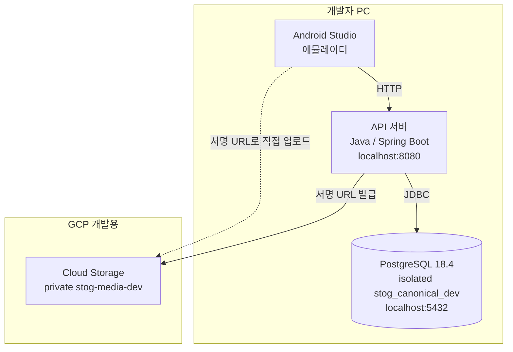
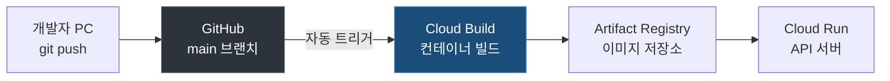
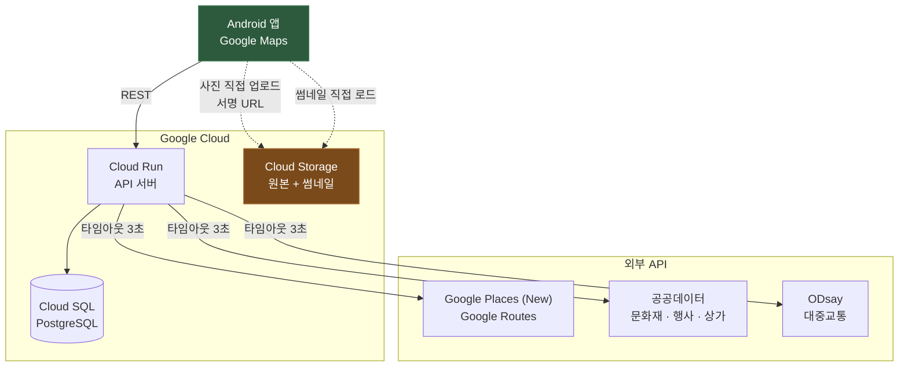
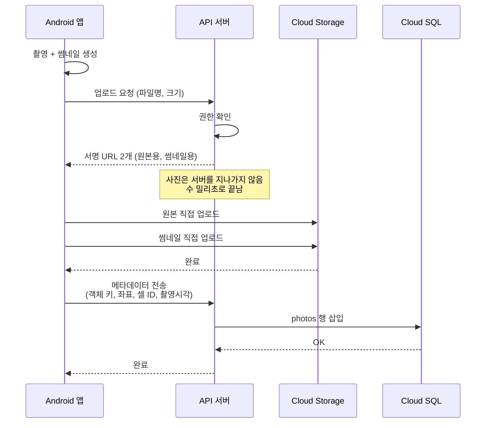
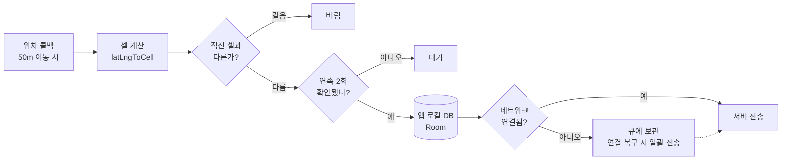

# STOG 인프라 도식

> AI 기능의 실행 경계는 `architecture.yaml`의 A-03 미결정 항목입니다.
> 아래 도식은 확정된 API 서버 중심 구조만 표시하며, 독립 AI 서버는 결정 후 추가합니다.

## 1. 로컬 개발 환경

개발 중에는 클라우드를 거의 안 씁니다. 로컬 DB는 Docker가 아닌 기존 local PostgreSQL 18.4 cluster 안의 isolated `stog_canonical_dev` database입니다. C-drive persistence는 환경 최적화로 미룹니다. **사진 저장소만 실제 GCS를 쓰고 나머지는 전부 내 PC에 있습니다.**

DB 접속 정보, bucket과 외부 서비스 주소는 환경변수 또는 Spring profile로
주입한다. DB에는 provider-independent `object_key`만 저장하고 local 절대경로,
bucket URL, signed URL은 저장하지 않는다. Vector 저장은 현재 보류하며, 향후
생성 시 `embedding_model`, `embedding_version`, `source_entity_type`,
`source_entity_id`를 함께 보존한다.

**왜 사진만 실제 GCS인가**: 로컬 파일시스템에 저장하면 서명 URL 흐름을 테스트할 수 없습니다. 이 부분이 배포 후 가장 많이 깨지는 곳이라 개발 때부터 실제 버킷을 씁니다. 개발은 private `stog-media-dev`, Cloud 운영은 private `stog-media`를 사용하며 환경별 버킷을 분리합니다.

**AI 기능은 어디서 실행하나** — 아직 확정하지 않았습니다. Python/FastAPI 독립 서비스가 현재 후보지만, A-03이 결정되기 전에는 별도 프로세스와 DB 연결을 전제로 구현하지 않습니다.

---

## 2. 배포 흐름

현재 단계에서는 `main` 머지로 Cloud Run을 자동 배포하지 않습니다. 백엔드
개발 완료 후 별도 승인된 배포 Task에서만 Cloud Build image와 Cloud Run
service/revision, traffic을 연결합니다. 현재 GCP Task는 Artifact Registry
image push와 canonical data 검증까지만 수행합니다.

**Cloud Run을 쓰는 이유** — 요청이 없으면 인스턴스가 0으로 내려가 비용이 안 나갑니다. 대회 기간 중 심사 전까지는 거의 놀고 있을 테니 이 특성이 큽니다. 서버 관리도 필요 없고요.

**주의점** — 별도 배포 Task에서 Cloud Run을 도입할 때 콜드 스타트와 최소
인스턴스 정책을 다시 승인합니다. 현재 Task에서는 Cloud Run traffic을
변경하지 않습니다.

---

## 3. 운영 시 런타임 구조

**점선이 핵심입니다.** 사진은 앱과 Cloud Storage가 직접 주고받고 API 서버를 안 거칩니다. 서버가 중계하면 사진 한 장에 서버 스레드가 몇 초씩 묶여서, 동시 접속자가 조금만 늘어도 타임아웃이 터집니다.

독립 AI 서버를 선택하면 API 서버와 별도 Cloud Run 사이의 호출과 읽기 전용 DB 경계를 이 도식에 추가합니다. 같은 실행 단위를 선택하면 별도 Cloud Run은 만들지 않습니다.

---

## 4. 사진 업로드 상세

**순서가 중요합니다.** GCS 업로드가 먼저고 DB 삽입이 나중입니다. 반대로 하면 존재하지 않는 사진을 가리키는 레코드가 생겨서 화면이 깨져요. 이 순서라면 최악의 경우 주인 없는 파일이 남을 뿐이고, 그건 나중에 정리하면 됩니다.

---

## 5. 위치 수집 — 오프라인 대비

**앱 로컬 DB를 반드시 거칩니다.** 산속이나 지하에서 네트워크가 끊겨도 기록이 사라지면 안 됩니다. 서버 전송은 실패해도 되지만 로컬 저장은 실패하면 안 돼요.

셀 계산과 연속 2회 확인은 **앱에서** 합니다. 서버로 모든 GPS 점을 보내면 8시간 여행에 수천 건이 되지만, 앱에서 걸러 셀 전환만 보내면 수십 건으로 줄어듭니다.
